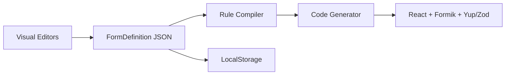

# FormForge

A browser-only **form specification tool** for developers and product teams. Define fields, validation, conditional logic, and repeatable sections visually — then generate production-ready **React + Formik** code with **Yup** or **Zod** validation.

**This is not** a drag-and-drop website builder or a no-code platform. It is a developer-focused **visual compiler**: the output is clean, readable React code.

---

## How It Works



All editors read and write a single **UI-agnostic JSON schema**. Code generation is a pure function of that schema — the UI never emits framework-specific components directly.

---

## Features

| Area | What you can do |
|------|-----------------|
| **Form Builder** | Add, edit, reorder, and delete fields (text, number, email, phone, date, textarea, select, radio, checkbox, file) |
| **Rule Builder** | Visibility rules, validation rules (including conditional), field dependencies, repeatable sections |
| **Live Preview** | Run the form with Formik + Yup in the browser |
| **Code Generator** | Output Material UI or Plain JSX components |
| **Validation** | Generate Yup or Zod schemas (conditional rules and repeatable sections supported) |
| **Templates** | 16 built-in examples across 5 categories — each teaches a platform feature |
| **Import / Export** | Share form definitions as JSON |
| **Persistence** | Auto-saves to LocalStorage — no backend required |

---

## Quick Start

```bash
npm install
npm run dev
```

| Route | Purpose |
|-------|---------|
| `/` | Landing page with featured templates |
| `/app` | FormForge editor |
| `/app?template=registration` | Open editor with a template pre-loaded |

**Scripts:** `dev` · `build` · `preview` · `lint` · `typecheck`

---

## Application Layout

Three-column desktop layout:

```
┌─────────────────┬──────────────────────────┬─────────────────┐
│  Form Explorer  │   Form Builder           │  Code Generator │
│  (forms,        │   + Rule Builder         │  (MUI / JSX,    │
│   templates)    │                          │   Yup / Zod)    │
└─────────────────┴──────────────────────────┴─────────────────┘
```

1. Create or select a form in the **Explorer**
2. Define fields in the **Builder**
3. Configure rules in the **Rule Builder** (visibility, validation, dependencies, repeat sections)
4. Preview and copy generated code from the **Code Generator**

---

## Form Schema

The schema in `src/types/` is the single source of truth. Fields are framework-agnostic — no `TextField`, `OutlinedInput`, or other UI components in the definition.

```typescript
interface FormDefinition {
  id: string;
  name: string;
  description?: string;
  fields: FormField[];
  sections: RepeatableSection[];
  rules: {
    visibility: VisibilityRule[];
    validation: Record<string, ValidationRule[]>;
    dependencies: DependencyRule[];
  };
  version: 1;
}
```

**Field types:** `text` · `number` · `email` · `phone` · `date` · `textarea` · `select` · `radio` · `checkbox` · `file`

**Condition operators:** `equals` · `notEquals` · `greaterThan` · `lessThan` · `contains` · `startsWith`

**Validation types:** `required` · `minLength` · `maxLength` · `min` · `max` · `regex` · `email` · `phone`

---

## Templates

16 templates in `src/templates/`, registered in a centralized `index.ts`:

| Category | Templates |
|----------|-----------|
| **Basic Forms** | Login, Registration, Contact, Newsletter Signup |
| **Validation** | User Profile, Product Creation |
| **Conditional Logic** | Country Based Identity, Age Based Registration, Employment Status |
| **Repeatable Sections** | Previous Address History, Family Members, Education History |
| **Business Forms** | Employee Onboarding, Employment Verification, KYC, Loan Application |

Each template is a complete `FormDefinition` demonstrating specific patterns — from basic required fields to country-based dependencies, conditional validation, and `FieldArray` sections.

**Featured on landing page:** Registration · Country Based Identity · Age Based Registration · Previous Address History · Employee Onboarding · Employment Verification

---

## Architecture

```
src/
├── types/              # FormDefinition schema
├── store/              # Zustand (formStore + uiStore) + LocalStorage persistence
├── engine/             # conditionToExpression, validationCompiler, ruleCompiler
├── services/
│   ├── codeGenerator/  # Formik component + Yup schema generation
│   ├── renderers/      # MUI and Plain JSX output adapters
│   ├── validationEngines/  # Yup and Zod adapters
│   ├── formRuntime/    # Live preview runtime
│   └── importExport/   # JSON import/export + schema validation
├── templates/          # Built-in form templates by category
├── components/         # Explorer, Builder, Rules, Codegen, Preview
├── landing/            # Marketing landing page
└── pages/              # ForgeApp route
```

### Code generation pipeline

```
FormDefinition
  → Renderer (mui | jsx)
    → Validation Engine (yup | zod)
      → GeneratedCode { component, validationSchema, initialValues }
```

Renderers decide **how** fields are rendered. Validation engines decide **how** rules are compiled. The schema stays unchanged.

---

## Tech Stack

React 19 · TypeScript · Vite · Material UI · Formik · Yup · Zod · Zustand · react-router-dom

---

## Philosophy

- **Generated code quality** matters more than decorative UI
- **Schema-first** — one JSON definition drives preview, export, and codegen
- **Extensible adapters** — new renderers and validation engines plug in without touching the schema
- **Local-first** — everything runs in the browser

---

## License

Private project. All rights reserved.
